# Langkah-langkah Praktik

## 1. Menginstall Git
Untuk menginstal git bisa dilakukan pada [halaman download Git](https://git-scm.com/downloads). Setelah mendowndload dan menginstall git, periksa penginstalan dengan cara menuliskan ``` $ git --version ``` pada git console.

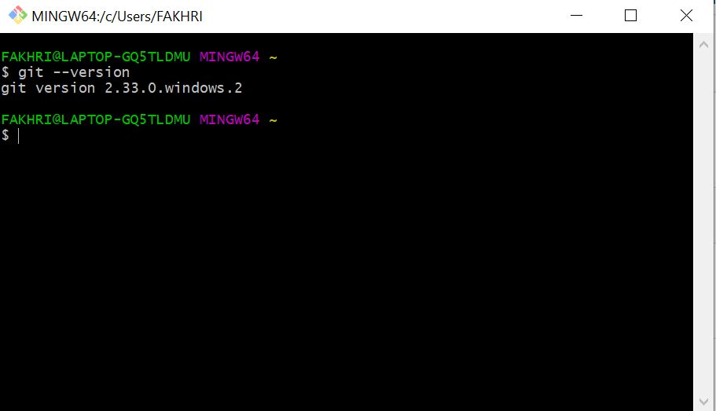

Jika muncul versi gitnya, maka penginstalan berhasil.

## 2. Melakukan Konfigurasi Git
Konfigurasi git bertujuan agar git mengetahui siapa yang melalukan commit atau melakukan perubahan pada repo. Konfigurasi git dilakukan dengan cara :
```
$ git config --global user.name "Nama Anda di GitHub"
$ git config --global user.email email@domain.tld
```
contoh :
```
$ git config --global user.name "fakhrizaki27"
$ git config --global user.email fakhrizaki27@gmail.com
```
menuliskan ``` $ git config --list ``` pada console git untuk melihat konfigurasi git.

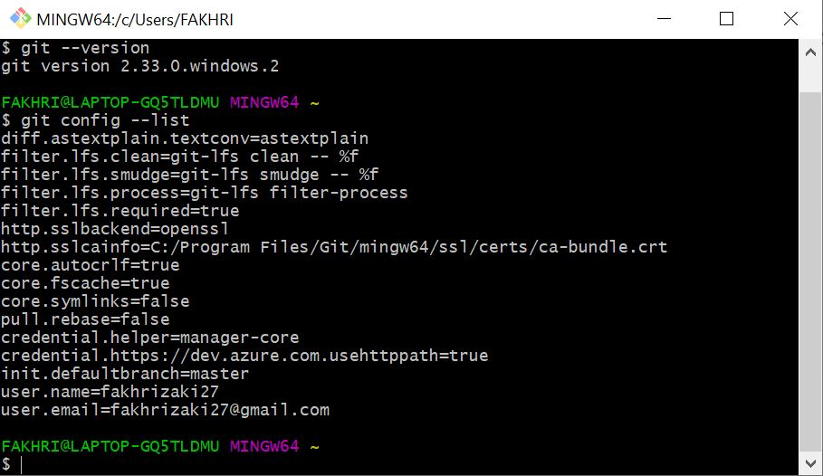

## 3. Mengelola Repo

### 3.1. Membuat Personal Access Token
Untuk membuat personal access token dapat dilakukan dengan mengikuti langkah-langkah pada https://docs.github.com/en/authentication/keeping-your-account-and-data-secure/creating-a-personal-access-token

### 3.2. Membuat Repository
langkah - langkah :
- Klik tanda '+' dan pilih New Repository
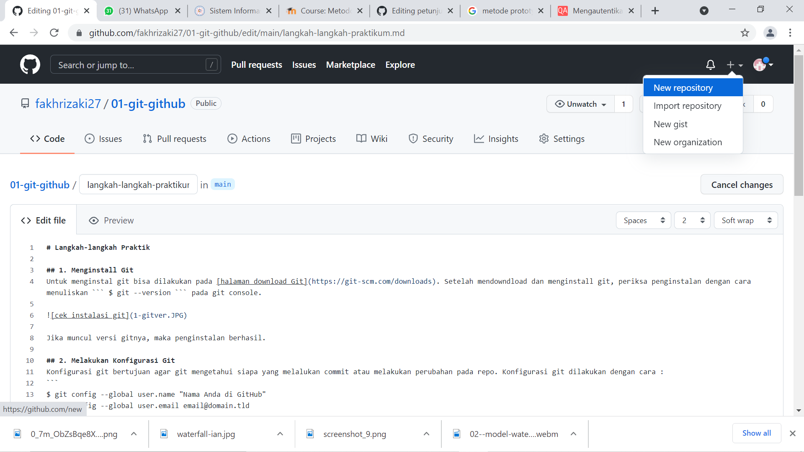

- Isikan nama repo, keterangan bila perlu, kemudian pilih private atau public tersserah. disini saya menambahkan README.md agar repo tidak kosong saat di clone


- Klik Create Repository
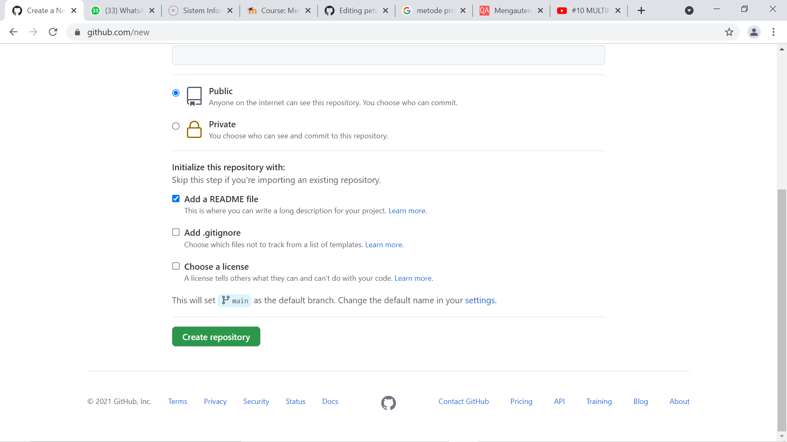

### 3.3. Menduplikat Repo ke Komputer Lokal (CLoning)
Untuk mengclone dapat dilakukan dengan menuliskan perintah seperti berikut :
```
$ git clone https://github.com/fakhrizaki27/coba-coba.git
```
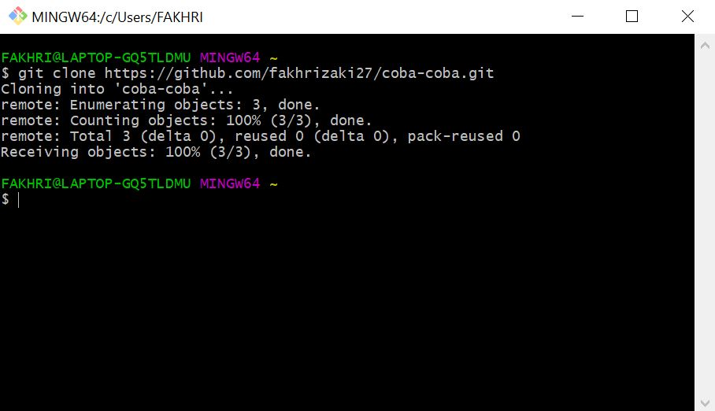

Untuk mengetahui file clone disimpan di directory mana bisa dengan cara menuliskan ``` $ pwd ```
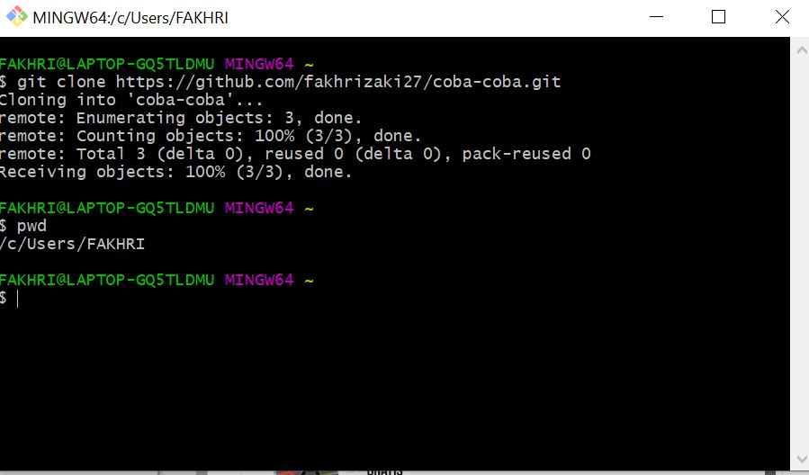

kemudian pada git harus masuk kedalam folder yang diclone tadi agar bisa melakukan perubahan. hal ini bisa dilakukan dengan melakukang change directory
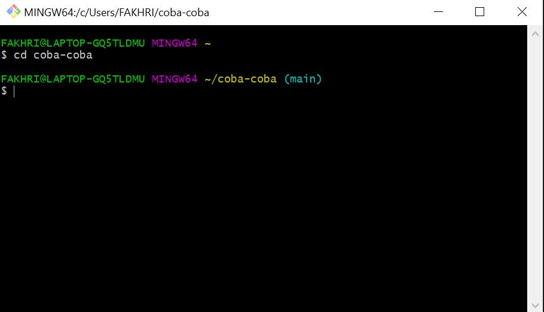

### 3.4. Mengubah Isi Repository
#### 3.4.1. Menambahkan File
Disini saya menggunakan Visual Stuio Code Untuk text editornya. pada repo ini saya menambahkan 1 file yang bernama index.html
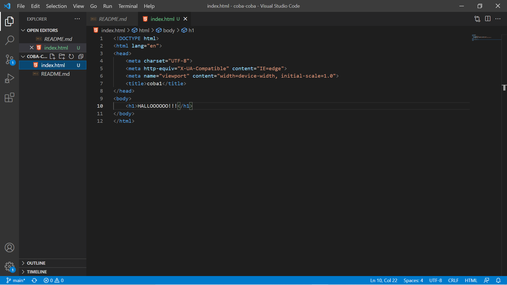

file tersebut masih berada di working area dan haus di pindahkan ke staging area. untuk mengetahuinya dengan cara menuliskan ``` $ git status ```

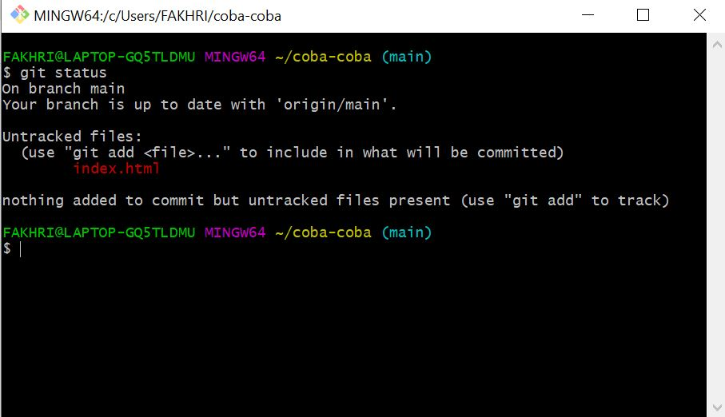

untuk memindahkan ke staging area yaitu dengan cara seperti berikut
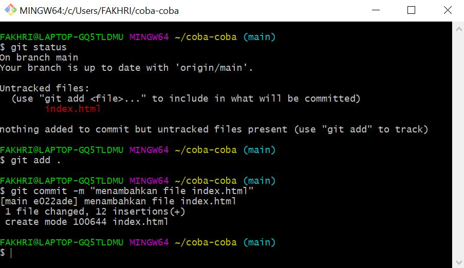

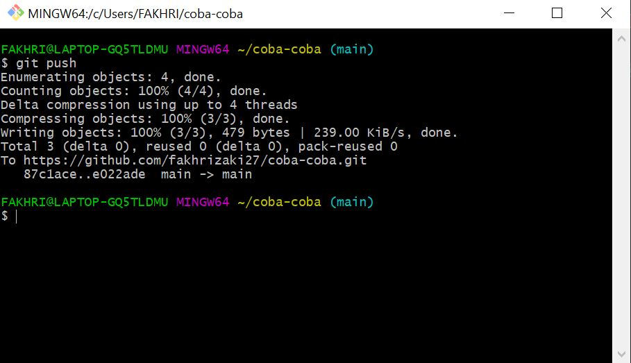

pada bagian ``` $ git push ``` diperlukan code access token yg tadi dibuat.
Jika di cek pada repository di github maka file index.html sudah ditambahkan
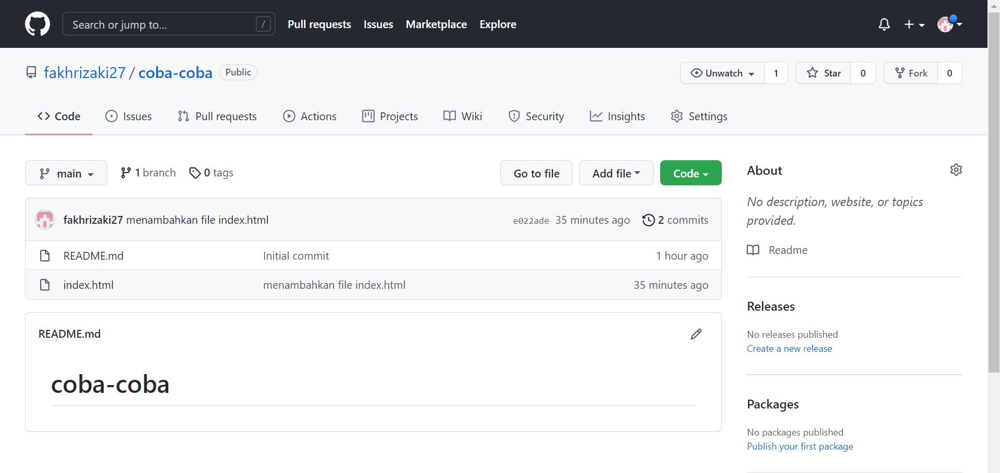

#### 3.4.2. Mengubah data / mengubah isi file
Masuk ke dalam teks editor dan modifikasi filenya
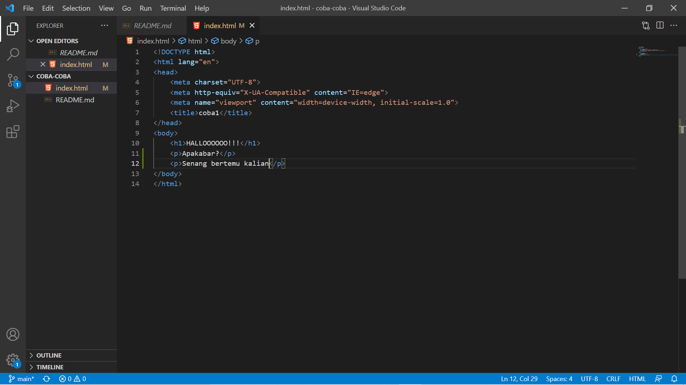

kemudian commit
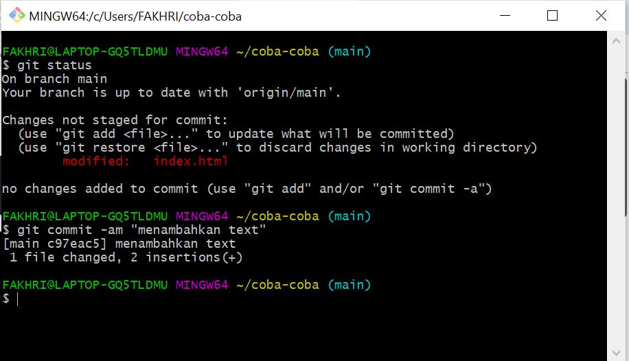

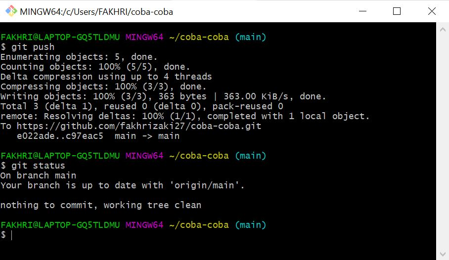

#### 3.4.3. Membatalkan Perubahan
Menggunakan perintah ``` $ git checkout ```

#### 3.4.4. Undo Commit Terakhir
Menggunakan perintah ``` $ git revert ```
